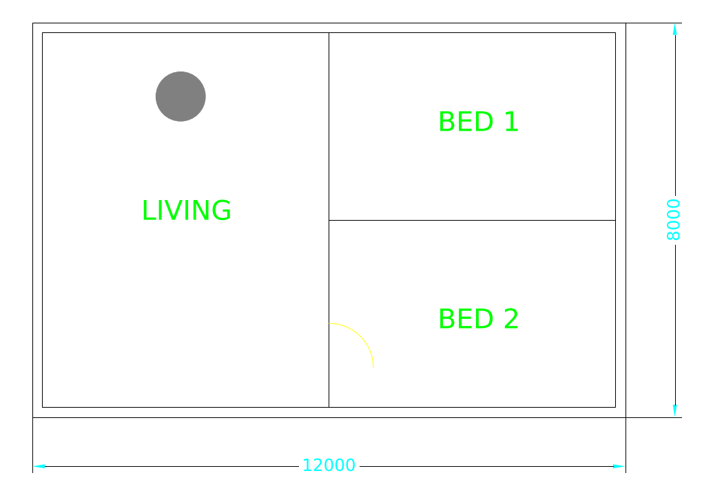

# Power CAD MCP

AI 어시스턴트(Claude Desktop, Claude Code 등 MCP 클라이언트)가 **AutoCAD 2027 도면을 읽고, 수정하고, 검증**하도록 해 주는
[Model Context Protocol](https://modelcontextprotocol.io) 서버 모음입니다.

| 구성 | 위치 | 용도 |
| --- | --- | --- |
| **power-cad-server + AutoCAD 2027 플러그인 (C#/.NET 10, 주력)** | [`dotnet/`](dotnet) | 실도면 수정. AutoCAD 내부에서 트랜잭션으로 실행하고, 수정 직전 대상 확인·수정 직후 자동 검증·실패 시 롤백 |
| power-cad-mcp (Python) | [`src/power_cad_mcp`](src/power_cad_mcp) | COM 폴백 작도(41개 도구)와 AutoCAD 없는 DXF/PNG/PDF 작도·미리보기 |
| best-cad-mcp (외부, 선택) | `uvx --from best-cad-mcp cad-mcp` | 도면 의미·객체 관계 분석 — 별도 MCP 서버로 함께 연결 |

- 설계 문서: [프레임워크](docs/framework/AutoCAD2027_Framework.md) · [운영 지침(ASTRA)](docs/framework/ASTRA_CAD_Operating_Playbook.md) ·
  [시각 안내](docs/framework/AutoCAD2027_Framework.html) · [오픈소스 고정 목록](docs/framework/framework.sources.json)

## 주력: power-cad-server (C#)

```
Claude ─stdio─▶ power-cad-server ─Named Pipe(토큰)─▶ PowerCad.Plugin.A27 (AutoCAD 2027 내부) ─▶ 도면 DB
```

도구 14개: `cad_status`, `cad_list_targets`, `cad_select_target`, `cad_query`, `cad_get`,
`cad_replace_text`(문자 변경), `cad_move`(객체 이동), `cad_modify_opening`(문·창·개구부 폭/위치/회전/반전/속성),
`cad_create`, `cad_batch`(최대 20단계 원자적 실행), `cad_context_query`, `cad_context_select`, `cad_context_actions`, `cad_context_action_select`.

모든 수정은 같은 절차를 거칩니다: **지문으로 대상 확인 → 한 트랜잭션에서 변경 → 변경된 대상만 재검증 → 실패 시 전체 롤백 → before/after 보고**.
`dry_run: true`로 실제와 같은 조건의 미리보기를 받을 수 있습니다.

### 설치 (Windows, AutoCAD 2027)

```powershell
git clone https://github.com/khs0927/power-cad-mcp
cd power-cad-mcp
powershell -ExecutionPolicy Bypass -File scripts\install_autocad_plugin.ps1
```

.NET 10 SDK가 없으면 winget으로 설치한 뒤 플러그인과 서버를 빌드하고, AutoCAD 번들을
`%APPDATA%\Autodesk\ApplicationPlugins\PowerCad.bundle`에 설치하고, Claude Desktop에 `power-cad`를 등록합니다.
AutoCAD를 재시작한 뒤 명령줄에서 `POWERCAD_STATUS`로 확인하세요.
빌드 없이 쓰려면 [Releases](https://github.com/khs0927/power-cad-mcp/releases)에서 `PowerCad-<버전>-win-x64.zip`을 받아 압축을 풀고, 그 폴더에서 `powershell -ExecutionPolicy Bypass -File scripts\install_autocad_plugin.ps1 -SkipBuild`를 실행합니다.

AutoCAD 없이 먼저 써 보기: `power-cad-server --simulate` (샘플 평면도: 벽, 실명, 동적 문, 창, 잠긴 레이어).

### 개발

```bash
./scripts/build_dotnet.sh          # restore → build(플러그인 포함) → 25개 테스트 → dist/PowerCad.bundle, dist/server/win-x64
dotnet test dotnet/PowerCad.Tests
```

---

## 보조: power-cad-mcp (Python)

- **AutoCAD 백엔드 (Windows)** — 실행 중인 AutoCAD에 COM으로 붙어 실시간으로 그립니다.
- **Headless DXF 백엔드 (모든 OS)** — AutoCAD 없이 [ezdxf](https://ezdxf.mozman.at/)로 도면을 만들고 DXF/PNG/PDF/SVG로 저장합니다.

두 백엔드는 같은 41개 도구를 제공합니다.



### 도구 목록 (Python)

| 분류 | 도구 |
| --- | --- |
| 세션/파일 | `cad_status`, `new_drawing`, `open_drawing`, `save_drawing`, `get_drawing_info`, `export_drawing`, `render_preview` |
| 레이어 | `list_layers`, `create_layer`, `update_layer`, `set_current_layer`, `delete_layer` |
| 작도 | `draw_line`, `draw_polyline`, `draw_rectangle`, `draw_polygon`, `draw_circle`, `draw_arc`, `draw_ellipse`, `draw_point`, `add_text`, `add_mtext`, `add_dimension`, `add_hatch`, **`draw_batch`** |
| 블록 | `list_blocks`, `create_block`, `insert_block` |
| 조회/편집 | `list_entities`, `get_entity`, `delete_entities`, `move_entities`, `copy_entities`, `rotate_entities`, `scale_entities`, `mirror_entities`, `offset_entity`, `set_entity_properties` |
| 화면/기타 | `zoom_extents`, `zoom_window`, `run_command` |

규칙:
- 좌표는 `[x, y]` 또는 `[x, y, z]`(도면 단위), 각도는 **도(degree)**, +X 기준 반시계 방향입니다.
- 생성된 모든 객체는 **handle**(16진 문자열)과 함께 반환되며, 이후 편집은 handle로 합니다.
- 색상은 ACI 번호(0–256) 또는 이름(`red`, `yellow`, `green`, `cyan`, `blue`, `magenta`, `white`, `bylayer` …).
- 많은 객체를 그릴 때는 `draw_batch` 한 번으로 처리하면 훨씬 빠릅니다 (AutoCAD 왕복 횟수 감소).
- 상대 경로는 `POWER_CAD_WORKSPACE`(기본: 현재 폴더) 기준으로 해석되며, 확장자가 없으면 자동으로 붙습니다.

## 설치 (Windows + AutoCAD 2027)

사전 조건: Windows 10/11, AutoCAD 2027 실행 중, Python 3.10+ (없으면 스크립트가 `uv`로 설치).

```powershell
git clone https://github.com/khs0927/power-cad-mcp
cd power-cad-mcp
powershell -ExecutionPolicy Bypass -File scripts\setup_windows.ps1
```

스크립트가 하는 일: `.venv` 생성 → 패키지 설치 → AutoCAD 연결 확인(`--check`) →
`%APPDATA%\Claude\claude_desktop_config.json`에 `power-cad` 서버 등록(기존 파일은 `.bak`으로 백업).
끝나면 Claude Desktop을 재시작하세요.

### 수동 등록

Claude Desktop (`%APPDATA%\Claude\claude_desktop_config.json`):

```json
{
  "mcpServers": {
    "power-cad": {
      "command": "uvx",
      "args": ["--from", "git+https://github.com/khs0927/power-cad-mcp", "power-cad-mcp"],
      "env": { "POWER_CAD_BACKEND": "autocad" }
    }
  }
}
```

Claude Code:

```bash
claude mcp add power-cad -e POWER_CAD_BACKEND=autocad -- uvx --from git+https://github.com/khs0927/power-cad-mcp power-cad-mcp
```

### 연결 확인

```powershell
.venv\Scripts\power-cad-mcp.exe --backend autocad --check   # 상태 JSON 출력, 연결 실패 시 exit 1
python scripts\smoke_test_autocad.py                         # 새 도면에 테스트 도형을 그림
```

## 설정 (환경 변수)

| 변수 | 기본값 | 설명 |
| --- | --- | --- |
| `POWER_CAD_BACKEND` | `auto` | `autocad` / `dxf` / `auto`(Windows면 AutoCAD, 아니면 DXF) |
| `POWER_CAD_PROGID` | – | COM ProgID 지정(쉼표 구분). 기본 순서: `AutoCAD.Application`, `.26`(2027), `.25`, `.24` |
| `POWER_CAD_LAUNCH` | `0` | `1`이면 AutoCAD가 꺼져 있을 때 직접 실행 |
| `POWER_CAD_WORKSPACE` | 현재 폴더 | 상대 경로 기준 폴더 |
| `POWER_CAD_DXF_PATH` | – | DXF 백엔드에서 시작 시 열/저장할 파일 |
| `POWER_CAD_ALLOW_COMMANDS` | `1` | `0`이면 `run_command` 비활성화 |
| `POWER_CAD_ALLOW_LISP` | `0` | `1`이면 `run_command`에서 AutoLISP 식 허용(위험 함수는 계속 차단) |
| `POWER_CAD_ONTOLOGY_ROOT` | – | `khs0927/Ontology` 로컬 checkout 경로. 설정 시 C# 주력 서버에서 CAIR context 도구 활성화 |
| `POWER_CAD_ONTOLOGY_COMMAND` | `aec-mcp` | Ontology MCP 실행 명령. ROOT가 설정된 경우 기본값 사용 |
| `POWER_CAD_ONTOLOGY_TIMEOUT` | `20` | Ontology stdio 호출 제한시간(초, 1–120) |
| `POWER_CAD_SION_URL` | – | Sion Ontology Platform의 HTTP base URL. 설정 시 Sion AEC federation을 우선 사용 |
| `POWER_CAD_SION_TIMEOUT` | `20` | Sion AEC HTTP 호출 제한시간(초, 1–120) |\n| `POWER_CAD_SION_TOKEN` | – | 원격 Sion 호출용 Bearer token. loopback이 아닌 Sion URL에는 필수 |

CLI 옵션: `power-cad-mcp [--backend auto|autocad|dxf] [--workspace DIR] [--dxf-path FILE] [--launch]
[--transport stdio|streamable-http|sse --host 127.0.0.1 --port 8765] [--check] [--version]`

## Sion / Ontology / CAIR 컨텍스트 연결

C#/.NET 10 주력 서버는 두 개의 읽기 전용 의미 컨텍스트 경로를 지원합니다.

- `POWER_CAD_SION_URL`이 설정되어 있으면 **Sion Ontology Platform의 `/api/v1/aec/query`를 우선 사용**합니다.
- Sion URL이 없으면 기존 `POWER_CAD_ONTOLOGY_ROOT` + `aec-mcp` 직접 연결을 사용합니다.

Sion 경로에서는 응답이 반드시 `canonical=false`, `read_only=true`여야 합니다. 이 계약을 만족하지 않으면 Power CAD가 컨텍스트를 거부합니다.

1. `cad_context_query`가 Sion 또는 Ontology에서 CAIR global memory를 검색합니다.
2. CAD 형식의 `geometry_ref`에서 handle 후보만 추출합니다.
3. 후보마다 현재 AutoCAD에 `cad_get`을 호출해 실제 존재와 fingerprint를 검증합니다.
4. 결과는 1, 2, 3… 번호가 붙은 `context_id` candidate space로 반환됩니다.
5. `cad_context_select(context_id, choice)`가 선택 시점에 fingerprint를 **다시 검증**합니다.
6. `cad_context_actions(context_id, candidate_choice)`가 현재 live entity에 허용되는 작업만 번호형 action-space로 반환합니다.
7. `cad_context_action_select(..., action_choice)`가 번호를 실제 `cad_get` / `cad_move` / `cad_replace_text` / `cad_modify_opening` 중 하나로 해석하면서 fingerprint를 다시 검증합니다.
8. 후보 선택과 action 선택 모두 `may_execute_mutation=false`입니다. 실제 수정은 기존 edit tool의 `expect_fingerprint`와 transaction/rollback 경계를 그대로 거쳐야 합니다.

골든 경로는 `Ontology → Sion AEC federation → Power CAD live verification → AutoCAD transaction/rollback`입니다. Ontology/GraphRAG/Sion 결과가 직접 AutoCAD를 수정할 수 없고, 오래된 지식이나 잘못된 매핑은 live CAD 재검증 단계에서 차단됩니다.

## 보안

`run_command`는 AutoCAD 명령줄에 그대로 입력을 보냅니다. 도면 속 텍스트가 프롬프트에 섞여 들어올 수 있으므로
AutoCAD 밖으로 나갈 수 있는 명령(`SHELL`, `START`, `SCRIPT`, `APPLOAD`, `NETLOAD`, `VBARUN`, `QUIT` 등)은 항상 차단되고,
AutoLISP는 기본적으로 꺼져 있습니다. 필요 없다면 `POWER_CAD_ALLOW_COMMANDS=0`으로 완전히 끌 수 있습니다.

## 구조

```
src/power_cad_mcp/
  server.py            MCP 도구 정의 (MCPServer, mcp SDK 2.x)
  backends/base.py     백엔드 인터페이스 (handle 기반, 각도=도)
  backends/com_backend.py   AutoCAD COM: 전용 STA 스레드, busy 재시도(IMessageFilter), 오류 변환
  backends/dxf_backend.py   ezdxf headless 백엔드 + 렌더링
  safety.py            run_command 필터
tests/
  fake_acad.py         AutoCAD COM 객체 모델 모사 → COM 백엔드를 Linux CI에서도 검증
  test_live_autocad.py 실제 AutoCAD 대상 테스트 (옵트인)
```

COM 객체는 스레드(아파트먼트)에 묶여 있고 MCP 런타임은 동기 도구를 임의의 워커 스레드에서 실행하므로,
모든 AutoCAD 호출은 하나의 전용 STA 스레드로 모아서 실행합니다. AutoCAD가 바쁠 때(`RPC_E_CALL_REJECTED`)는
COM 메시지 필터가 자동으로 재시도하며, 도형을 만드는 호출은 중복 생성을 막기 위해 통째로 재실행하지 않습니다.

## 개발

```bash
uv venv && uv pip install -e ".[dev]"
pytest                     # 59개 테스트 + 실기 AutoCAD 테스트 1개(옵트인) (DXF end-to-end, 가짜 AutoCAD COM, stdio 프로세스, 유닛)
ruff check . && ruff format --check .
python -m build            # dist/*.whl, dist/*.tar.gz
python examples/demo_floor_plan.py            # headless 데모 → examples/out/
python examples/demo_floor_plan.py --backend autocad   # 실행 중인 AutoCAD에 그리기
```

실제 AutoCAD 테스트 (Windows):

```powershell
$env:POWER_CAD_LIVE_TESTS = "1"; pytest -m autocad -v
```

## 문제 해결

- **`Could not attach to a running AutoCAD`** — AutoCAD가 실행 중이고 도면 하나가 열려 있는지 확인하세요.
  AutoCAD와 MCP 서버는 **같은 사용자, 같은 권한 수준**이어야 합니다(한쪽만 "관리자 권한으로 실행"이면 COM 연결 실패).
- **`AutoCAD stayed busy`** — 명령 실행 중이거나 대화상자가 열려 있습니다. AutoCAD에서 `Esc`를 누르고 다시 시도하세요.
- **PDF 내보내기** — `DWG To PDF.pc3` 플로터를 사용해 도면 범위를 용지에 맞춰 출력합니다.
- **DXF로 내보내기(AutoCAD)** — AutoCAD의 SaveAs를 사용하므로, 원래 DWG가 있다면 다시 원래 파일로 저장해 활성 문서를 되돌립니다.

## License

MIT
